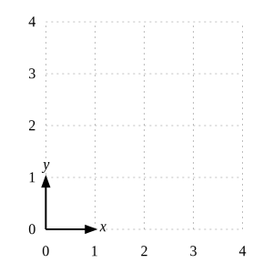
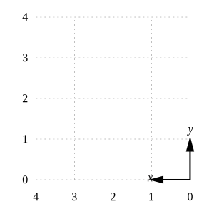
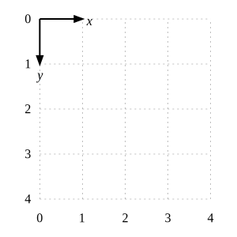
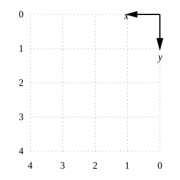

# axis
Create axis with and without grid as base of a figure

## axis
Result | Script
:-: | :-:
 | [xy-axis-sw](xy-axis-sw.gnu)
 | [xy-axis-se](xy-axis-se.gnu)
 | [xy-axis-nw](xy-axis-nw.gnu)
 | [xy-axis-ne](xy-axis-ne.gnu)

## axis with grid
Result | Script
:-: | :-:
 | [xy-axis-sw-grid](xy-axis-sw-grid.gnu)
 | [xy-axis-se-grid](xy-axis-se-grid.gnu)
 | [xy-axis-nw-grid](xy-axis-nw-grid.gnu)
 | [xy-axis-ne-grid](xy-axis-ne-grid.gnu)
