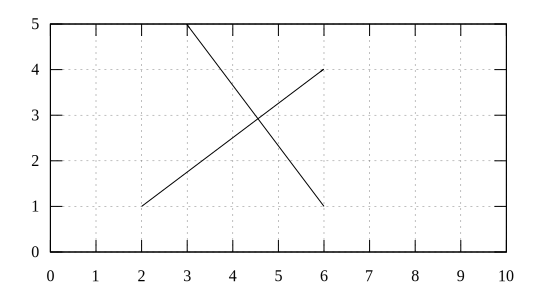
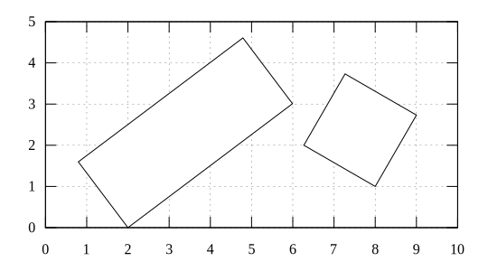

# free body diagram
Create free body diagram for physical problem with gnuplot

## component
Result | Script
:-: | :-:
 | [line-from-len-dir-call](line-from-len-dir-call.gnu) [line-from-len-dir](line-from-len-dir.gnu)
 | [block-call](block-call.gnu) [block](block.gnu)
