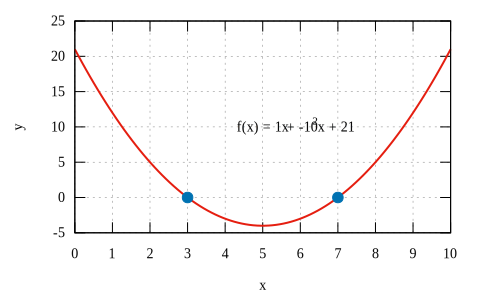

# function
Create plot of a function

## quadratic function
Result | Script
:-: | :-:
 | [quadratic-curve-standard](quadratic-curve-standard.gnu)
 | [quadratic-curve-factored](quadratic-curve-factored.gnu)
 | [quadratic-curve-vertex](quadratic-curve-vertex.gnu)