# ulm-eqn
Graph of motion variable for uniform linear motion with equation

## a = 0, v > 0
$x$ | $v$ | $a$ | Script
:-: | :-: | :-: | :-:
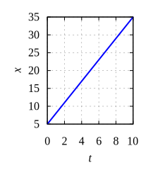 $x(t) = 3t + 5$ | 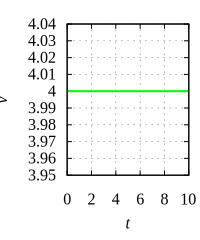 $v(t) = 4$ | 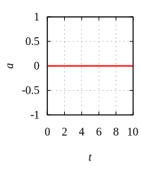 $a(t) = 0$ | [0](xva-eqn-0.gnu)
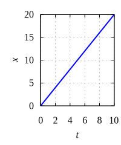 $x(t) = 2t$ | 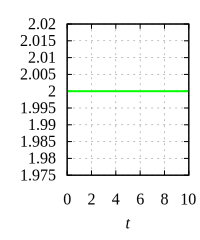 $v(t) = 2$ | 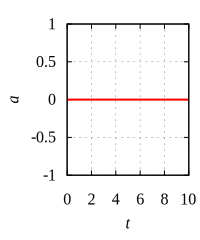 $a(t) = 0$ | [1](xva-eqn-1.gnu)
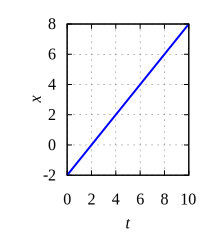 $x(t) = t - 2$ | 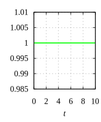 $v(t) = 1$ |  $a(t) = 0$ | [2](xva-eqn-2.gnu)

## a = 0, v = 0
$x$ | $v$ | $a$ | Script
:-: | :-: | :-: | :-:
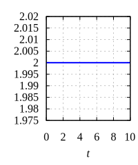 $x(t) = 2$ | 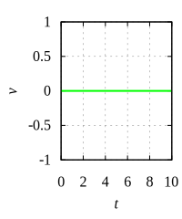 $v(t) = 0$ |  $a(t) = 0$ | [3](xva-eqn-3.gnu)
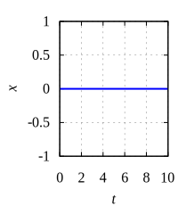 $x(t) = 0$ |  $v(t) = 0$ |  $a(t) = 0$ | [4](xva-eqn-4.gnu)
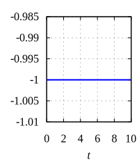 $x(t) = -1$ |  $v(t) = 0$ |  $a(t) = 0$ | [5](xva-eqn-5.gnu)

## a = 0, < = 0
$x$ | $v$ | $a$ | Script
:-: | :-: | :-: | :-:
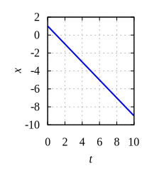 $x(t) = -t + 1$ | 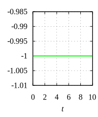 $v(t) = -1$ |  $a(t) = 0$ | [6](xva-eqn-6.gnu)
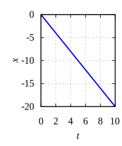 $x(t) = -2t$ | 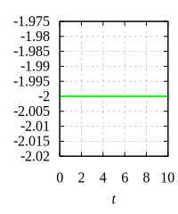 $v(t) = -2$ |  $a(t) = 0$ | [7](xva-eqn-7.gnu)
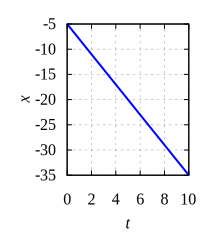 $x(t) = -3t - 5$ | 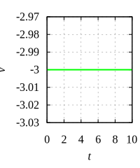 $v(t) = -3$ |  $a(t) = 0$ | [8](xva-eqn-8.gnu)