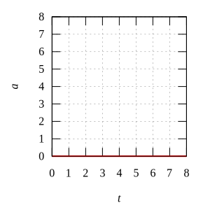

# uniform-linear-motion
Graph of motion variable for uniform linear motion

## a0-v1-x1
Result | Script
:-: | :-:
 | [a0-v1-x1](a0-v1-x1.gnu)
 | [a0-v1](a0-v1.gnu)
 | [a0](a0.gnu)

## a0-v1-x3
Result | Script
:-: | :-:
 | [a0-v1-x3](a0-v1-x3.gnu)
 | [a0-v1](a0-v1.gnu)
 | [a0](a0.gnu)

## a0-v1-x6
Result | Script
:-: | :-:
 | [a0-v1-x6](a0-v1-x6.gnu)
 | [a0-v1](a0-v1.gnu)
 | [a0](a0.gnu)

## a0-v2-x1
Result | Script
:-: | :-:
 | [a0-v2-x1](a0-v2-x1.gnu)
 | [a0-v2](a0-v2.gnu)
 | [a0](a0.gnu)

## a0-v0.5-x2
Result | Script
:-: | :-:
 | [a0b-v0.5-x1.5](a0-v0.5-x1.5.gnu)
 | [a0b-v0.5](a0-v0.5.gnu)
 | [a0b](a0b.gnu)

