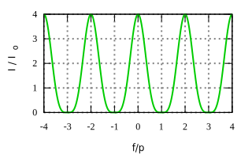
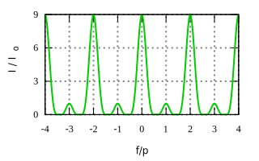
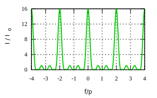
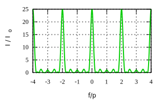
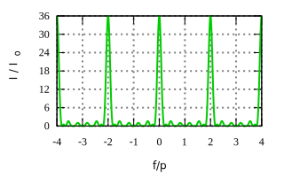
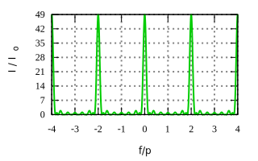
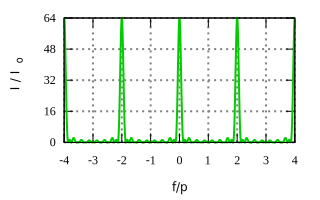

# interference
Create plot of interference intensity function

## interference of n slits
Result | Script
:-: | :-:
 | [interference_intensity_svg_2](interference_intensity_svg_2.gnu)
 | [interference_intensity_svg_3](interference_intensity_svg_3.gnu)
 | [interference_intensity_svg_4](interference_intensity_svg_4.gnu)
 | [interference_intensity_svg_5](interference_intensity_svg_5.gnu)
 | [interference_intensity_svg_6](interference_intensity_svg_6.gnu)
 | [interference_intensity_svg_7](interference_intensity_svg_7.gnu)
 | [interference_intensity_svg_8](interference_intensity_svg_8.gnu)