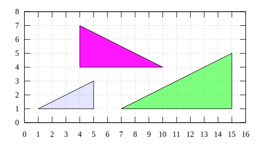
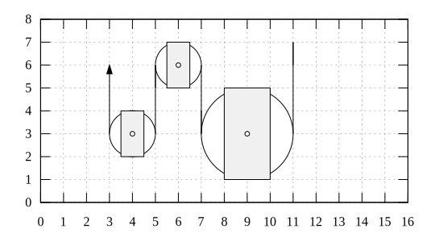
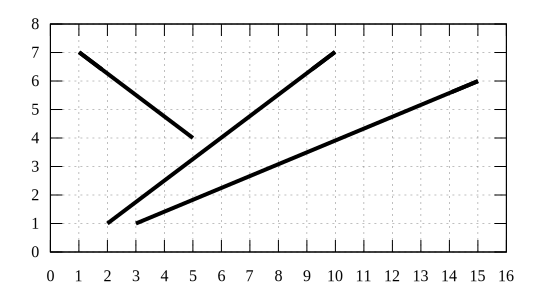

# machine
Illustration of (simple) machines using gnuplot

## simple machine
Result | Script
:-: | :-:
 | [incline-call](incline-call.gnu) [incline](incline.gnu)
 | [pulley-call](pulley-call.gnu) [pulley](pulley.gnu)
 | [inclined-beam-call](inclined-beam-call.gnu) [inclined-beam](inclined-beam.gnu)