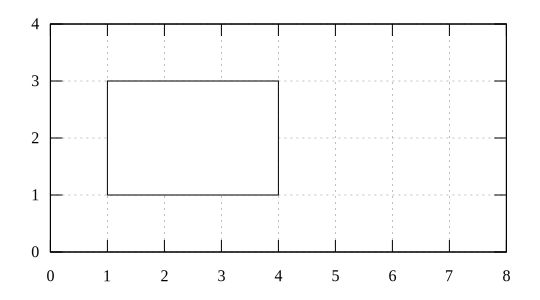
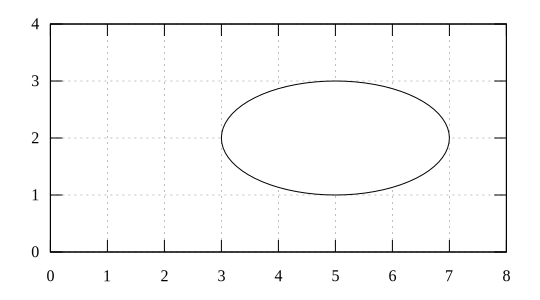
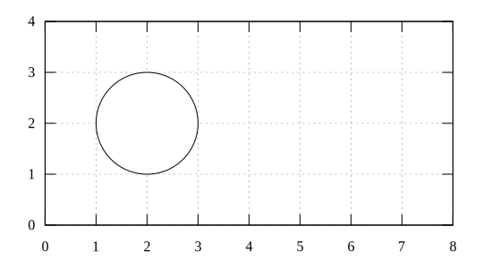
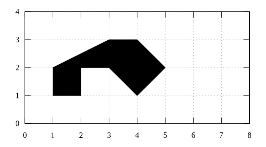

# object
Create object (rectangle, circle, ellipse, polygon) with gnuplot

## minimum script
Result | Script
:-: | :-:
 | [rectangle-min-script](rectangle-min-script.gnu)
 | [ellipse-min-script](ellipse-min-script.gnu)
 | [circle-min-script](circle-min-script.gnu)
 | [polygon-min-script](polygon-min-script.gnu)